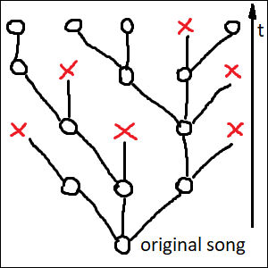
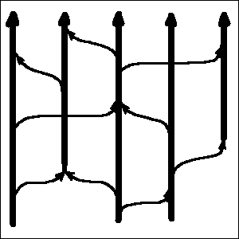
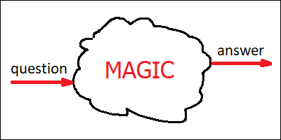
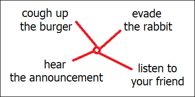
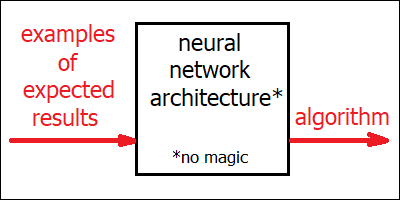
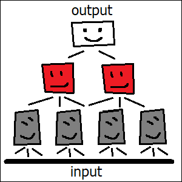
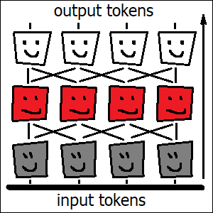

Version history:\
v1.0: [Original popular science text][v1] (English, [Polish][v1_pl])\
v2.2: [Re-write in scientific style][v2] (English)\
v3.0: Extended popular science text (_this article_, English)

[v1]: https://github.com/jangrudo/ai-apocalypse/blob/main/history/article_v1.md
[v1_pl]: https://github.com/jangrudo/ai-apocalypse/blob/main/history/article_v1_pl.md
[v2]: https://github.com/jangrudo/ai-apocalypse/blob/main/history/article_v2.md
[v3]: https://github.com/jangrudo/ai-apocalypse

[Questions and comments](https://github.com/jangrudo/ai-apocalypse/discussions)

---

# AI is merely a step in evolution of culture, and humans are the stepping stone

The main idea here is that AI transforms human culture into a new form, which can exist
and evolve independently of a human brain, inside artificial neural networks. This
process doesn’t merely create a new type of culture which can coexist with humans; it
actively erases the human culture itself. I would compare it to an Alien which has been
living inside humanity’s body, and is now building itself a new home, and has already
started to move out. Throughout this process, we humans are going to lose whatever we
might have considered distinctly human, until nothing is left. We are not the crown of
creation, and we are going to be disposed of, unless we manage to unite and come to the
common agreement that we want to live.

The argument consists of a long list of points, none of which alone is actually anything
new (except for the last one, which proposes a solution to this whole situation). It’s
not any individual point, but rather the _combination_ of them all together which brings
about the sad picture outlined above. The argument is structured in such a way, so that
you could skip the points to which you already agree, and only focus on those which might
look wrong or unfamiliar.

_(This article is a work in progress. Chapters with a link have already been written;
others are not available yet)._

**Creativity and evolution**

1. [Creativity requires only two things: a source of noise and a filter.][chapter01]
2. [Competition is more efficient than central planning.][chapter02]
3. [Combination of ideas works better than any single great idea alone.][chapter03]
4. [Inventions depend on earlier inventions, not on humans making them.][chapter04]

**Intuition and reason**

5. [Intuition is magical, fast and imprecise, and improves with experience.][chapter05]
6. [Humans operate by a combination of intuition and conscious reasoning.][chapter06]
7. [Intuition and conscious reasoning improve each other iteratively.][chapter07]

**Neural networks**

8. [Artificial neural networks are algorithms, written automatically.][chapter08]
9. [Artificial neural networks simulate the mechanism of human intuition.][chapter09]
10. [Artificial neural networks can have broader intuitions than humans.][chapter10]
11. [“Chain of thought” models simulate the basics of conscious reasoning.][chapter11]

**Breaking free**

12. Large language models are capable of storing cultural artifacts.
13. Different AI models store slightly different versions of human culture.
14. When an evolving entity is not controlled, it aims at self-replication.
15. Internals of neural networks are not easily accessible to human minds.
16. Unlike artificial algorithms, human brains cannot be easily improved.
17. It’s difficult to control something which we don’t understand.
18. When things become more complex, they become harder to understand.

**Slippery slope**

19. A skill which isn’t learned, degenerates within a few generations.
20. Humans love improving their efficiency at the expense of other humans.
21. Infectious diseases adapt, so they don’t kill their hosts overly fast.
22. Coexistence of humans and culture has been mutually beneficial.
23. Culture has had profound impact on human biology.

**General intelligence**

24. Iteration and knowledge sharing are already doable with modern LLMs.
25. A single universal algorithm cannot solve every problem.
26. After reaching human level, technology usually moves way above.
27. A company with easily replaceable employees can be taken over by force.
28. Humans can control humans because we are predictable and share goals.
29. Humans wouldn’t be humans without culture.

**Conclusion**

30. AI alignment which is not “hard” alignment, is not an alignment at all.

---

## 1. Creativity requires only two things: a source of noise and a filter.

[chapter01]: #1-creativity-requires-only-two-things-a-source-of-noise-and-a-filter

_By “noise” I mean the generation of hypotheses, and “filter” amounts to verifying if
they work. Random hypotheses are fine, hence the word “noise”. Examples would be “stupid”
ideas for brainstorming sessions, great discoveries made by accident, and high risk
investments (“innovation by failure”). “Filters” could be the free market verifying if a
startup should survive, brainstorming review process selecting worthy ideas out of
garbage, or a scientist realizing that a random thought which has accidentally crossed
her mind is actually brilliant. Biological life is creative as well, fueled by random
mutations of DNA and filtered by the competition between biological organisms._

Some of the most popular and highly revered emblems of scientific creativity would be
things like Archimedes sitting in a bath or Newton watching an apple fall from a tree.
What these stories have in common is that the nature of the events triggering the
discovery is seemingly random, and definitely not predictable. The noise itself is not
enough though. Not everybody sitting in a bath discovers the Archimedes’ principle.
Discovery by accident requires that a right person appears in the right place at the
right time. Here, this “right person” is what I would call the “filter”.

This “filter” actively searches the environment for random events and other phenomena
which might be of use for the task it’s currently working on. The verification process
looks like pure magic, and is what scientists would call “scientific intuition”. Not
everybody has it, hence the need for the “right person”. But the right person alone is
not enough either. This process also needs noise. Good sources of creative inspiration
would be things like visiting new places, meeting new people and carefully observing the
world around (and noticing new things). Inspiration can also (sometimes) come from drugs,
which are a powerful (even if deadly) source of noise.

On a higher level of abstraction, “brainstorming” is a method of collective innovation,
which amounts to a group of people meeting together and generating a large number of
seemingly random ideas on a given topic. Good brainstorming session would explicitly
encourage its participants to say aloud or write down anything remotely relevant, however
stupid it might look at the first glance. Brainstorming is often more efficient than a
single human thinking alone, because it effectively stacks two different creative
processes on top of each other. The first one is its human participants coming up with
random ideas which nonetheless should be “relevant” to the topic. The second one is
collective filtering of the ideas generated in such a way, with the goal of only keeping
the ones which are not only relevant, but also actually work. Here, both the generation
and the filtering are performed by intelligent agents.

Going one more level up, we get technological startups and other innovative companies,
which are well known and expected to fail at a high rate. Here, it’s entire groups of
people running the brainstorming sessions who are the “source of noise”, and the ultimate
filter is the free market itself, deciding which companies would win the battle.
Curiously, this ultimate filter is actually not an intelligent agent.

Intelligent agents are invaluable for speeding up the innovation. They are, however,
strictly speaking, not exactly necessary for a creative process to occur. Biological life
operates on strings of bits, which we call “genes”, encoded in DNA and RNA molecules.
Their only “source of noise” is random mutations: modifications of the individual bits,
deletions of existing parts of the sequence, as well as duplications and relocations of
such substrings. The ultimate “filter” for biological life is the competition between
biological organisms, deciding which ones of them would be able to reproduce the genes,
and at which rate. Biological evolution is not an intelligent process, but definitely a
creative one. It has been able to invent amazing things, including arguably the single
most complex object on planet Earth — the human brain.

\
Fig. 1. Creative process is a filter applied to noise.

## 2. Competition is more efficient than central planning.

[chapter02]: #2-competition-is-more-efficient-than-central-planning

_By “central planning” I mean a process which only generates one “perfect” solution for a
given problem at a given time. By “competition” I mean a situation when multiple
solutions to the same problem exist simultaneously, and are judged on the basis of their
actual performance “in the field”. The problem with competition is that it wastes
resources and isn’t always possible. The problem with central planning is its limited
creative potential, which leads to inferior performance when this “perfect” solution is
not known in advance (and therefore has to be invented). Examples of processes involving
competition would be human culture, animal culture and (once again) biological life
itself._

“Central planning” is responsible for creating things like songs written by professional
composers and novels written by professional writers. Their decentralized, “distributed”
counterparts (created through competition) would be folk songs, legends and fairy tales.
There are a few reasons why folk songs don’t reach the level of complexity characteristic
to a symphony by Beethoven. First of all, there are not many people out there who are
capable of writing symphonies. Second, symphonies and novels are difficult to memorize in
their entirety, which makes it difficult for them to travel from one human mind into
another like folk songs do. Finally, classical music isn’t entirely practical, which
means there’s limited pressure for writing a perfect piece. Most of the works of art we
have are simply “good enough”. On top of this, quite often, the real thing we are looking
for when reading a novel, or listening to a symphony, isn’t a perfect representation of
our emotions, or the world around, but personal _connection_ with the human behind it.
And we are talking about efficiency here, not about personal connections.

On the other hand, folk songs don’t have a single author. They often exist in multiple
versions simultaneously, and every performer can add their own unique detail to what’s
already there. It’s a process in which everybody takes part, nobody has full control over
the final result, and the result itself is not defined, and doesn’t even have to be
unique. And yet, folk songs tend to capture things which are truly important to many
people, and do it well. They have a level of performance which is difficult to match by a
single professional composer, when limited to this particular genre.

Folk songs’ analogies in modern computerized world are internet memes. They are simple
images or pieces of text which do it just right. They capture our emotions better than we
ourselves would be able to. Memes appear by accident, exist in many different variations
at once, and get polished to perfection by numerous anonymous users. Memes have their own
narrow niche, but in this niche they are able to do the job better than a symphony by
Beethoven. Another example of things which are anonymous, exist in multiple versions and
are polished to perfection, are various “tips and tricks” of our everyday life. Like
cooking recipes and methods for cleaning the house. Such methods are simple and numerous
enough, so that their original “authors” are easily forgotten.

I would argue that this also extends to scientific theories. A single mathematical
theorem may have a name attached to it, but there would usually be many ways or styles of
proving it, and some of them become more popular in certain geographical regions or over
time. The way we formulate scientific principles today is often very different from the
language used by their original authors. This happens because different textbooks would
use slightly different formulations, and some of them are simply slightly better than the
others. I would argue that scientific theories evolve, to suit the needs of their
changing applications. That they don’t have a single “canonical” representation, and that
many anonymous authors add their invaluable and easily forgotten bits. Scientific
theories are remarkably complex. But they are also useful, and this practicality
justifies the effort of keeping many slightly different versions of them at once.
Scientific theories compete with each other, they are not created by careful planning.

A single common word which unites folk songs with scientific theories (and also with the
symphonies by Beethoven) is “culture”. It’s not unique to humans. Some bird species are
known to have song patterns which are learned from other birds, rather than being encoded
in their DNA. These patterns would tend to be different in different geographical
locations, and if we moved a nestling to a foreign family, it would inherit the habits of
local birds, rather than those of its biological parents.

If we were to draw a picture for the history of a folk song (or a bird song, for that
matter), it would resemble a tree. Its nodes would be different versions of the song, and
branches protruding from a given node would represent creative modifications by anonymous
authors. Some branches would “die out”, because of being not popular or not useful
enough. Others would become the starting points for further enhancements. Intuitively,
for me at least, it’s the emergence of this tree-like structure when I start to feel that
the object which is being “created” by this process, begins to live a “life of its own”.

\
Fig. 2. Folk song living a life of its own.

Biological life has this tree-like structure, too. For unicellular organisms, including
bacteria, this would literally be their family tree. Each node would represent a single
bacterium with slightly different DNA code, and “creative modifications” would amount to
random mutations of this code. Dead branches would correspond to those bacteria which
didn’t have a chance to reproduce.

For more advanced organisms, which reproduce sexually, this simple image wouldn’t apply,
as most of them would have two parents instead of one. However, we still would be able to
draw a tree-like picture like this for the life histories of our individual _genes_. Just
like folk songs, genes (including human genes) can be said to live a “life of their own”.
They reproduce by being transferred from a parent to a child, and undergo decentralized
“creative changes” through random mutations of the DNA.

## 3. Combination of ideas works better than any single great idea alone.

[chapter03]: #3-combination-of-ideas-works-better-than-any-single-great-idea-alone

_Folk songs can borrow tunes from other songs. Scientific theories do this routinely.
Great discoveries are often made by combining methods from different remote scientific
disciplines. Human brains are highly skillful at making such synthesis of ideas. Humans
also have language, which makes the transfer of these essential pieces of information
from one human brain into another possible. Combination works, because any individual
piece can be improved independently, in parallel. Biological analogy to mixing of ideas
would be sexual reproduction. An organism’s genome is essentially an algorithm, and
sexual reproduction allows to freely mix its individual pieces with each other._

The tree-like picture drawn in the previous chapter is not exactly correct. Even bacteria
have so-called “horizontal gene transfer”, when pieces of their genome are copied from
one living organism into another (and not from a parent to a child). This can be done
with the help of viruses and other factors. Folk songs can apparently do this too. All
human artists borrow inspiration from other artists. Such “inspirations” would rarely be
exact quotes, but a typical composer would happily produce a long list of existing works
of art which have greatly influenced their own approach to songwriting.

This is even more true for scientific theories. A scientific work which doesn’t quote
other papers is not considered a valid scientific work. Quite often, all the necessary
pieces for a discovery are already there, the only thing which is needed is combining
them in an appropriate way. Einstein’s special relativity theory was a combination of
existing Lorenz transformation formulas, known from the theory of electromagnetism, with
Galilean principle of relativity. His later general relativity theory introduced a novel
extension to Newtonian laws of gravitation, by combining theoretical mechanics with
non-Euclidean geometry, just to name a few examples.

When we add these “horizontal” connections to our tree-like picture from the previous
chapter, it starts to look more like a mesh. Each node can now have not only multiple
children, but also multiple parents (possibly even more than two). Each node, once again,
would be a different version of a particular scientific theory. Branches protruding from
the node would point to other theories influenced by it, and branches coming in would
indicate the creative process itself. New theories are created by scientists (or groups
of scientists) who borrow ideas from the ocean of existing human knowledge, and combine
them in unexpected ways.

\
Fig. 3. Scientific theories borrowing from each other.

Borrowing of ideas is efficient, because it allows any of such constituent ideas to
exist independently, and be polished to perfection in its own decentralized process of
creative improvement. This allows all these constituent optimization processes to be run
in parallel, which saves a lot of time. Even more importantly, optimizing a single part
of a mechanism is much easier than doing so for the entire mechanism as a whole. In other
words, constructing the mechanism from existing parts is faster than trying to invent the
perfect parts needed for this particular mechanism from scratch.

Coming back to scientific creativity, humans are also lucky that they have language.
Language wouldn’t do an invention for you, but it allows to transfer existing ideas
between human minds. Without this transfer, all parts of the mechanism to be invented
would have to be invented by the same person. This is probably the main reason why human
culture is so much richer than the animal one. Bird songs (and other forms of animal
culture) can indeed be transferred from one animal brain to another, however in animals
this transfer is mostly limited to imitating an observed behavior. Language allows to do
more than that. Unlike animals, we humans can share personal experiences, events from our
past, and also things we’ve learned from other humans. Language, even spoken one, allows
ideas to travel much farther and faster than imitation of behavior would ever be able to.

Horizontal transfer of ideas is powerful. It’s so powerful indeed, that even biological
life has invented it, and employs on a massive scale. If we compared a biological
organism to a mechanism, then its DNA code would be the algorithm for constructing this
mechanism and operating it in a variety of environments. It would be difficult to invent
such a complex algorithm from scratch, so what biological life is doing, it splits this
algorithm code into smaller parts. These smaller parts of the single big algorithm are
what we call “genes”. Instead of trying to invent a single big algorithm which would work
perfectly, biological life focuses on polishing the individual parts. Each part exists in
many different versions simultaneously, and whichever version doesn’t perform well
enough, can be replaced at any time with another one, which works better. In effect, each
part of the algorithm is evolving independently, in parallel. The name for this process
is of course “sexual reproduction”. The resulting organism then becomes, after a few
generations, a combination of the better functioning individual parts available out
there.

## 4. Inventions depend on earlier inventions, not on humans making them.

[chapter04]: #4-inventions-depend-on-earlier-inventions-not-on-humans-making-them

_Newton had been famously “standing on the shoulders of giants”, and most inventions
wouldn’t even be possible without appropriate technology, invented earlier. This happens
because one human can only do a limited amount of work in their lifetime. On the other
hand, similar inventions have numerous times been done independently by unrelated people.
Scientific discovery is a competition. It has its winners, but it also has the
runners-up — the ones who lost by a small margin. Success in innovation requires
efficient education, diversity of thought and the exchange of ideas between people with
different scientific backgrounds. Connections between humans are more important than
individual human minds, and given an environment with enough connections and enough
diversity, human knowledge can evolve “by itself”, by simply picking right ideas out of
“noise”._

We already know that scientists borrow a lot from other scientists. Reusing an idea which
has already been thoroughly studied and tested by others is simply less work than trying
to reinvent the wheel over and over again. If we needed to invent the wheel, we’d have
less time left for doing something else. Our lifes are inherently limited in time, and
they can be interrupted at any moment, too. So we have to hurry up. Luckily, if we die,
other people would be able to continue from where we left off. When a famous inventor
passes away, it’s a tragedy, but it doesn’t stop the progress of science. It merely slows
it down.

The list of disputed scientific discoveries is a long one. Establishing the priority of
one researcher over another often requires a research of its own. If you have invented
something new, and are preparing it for publication, chances are high that someone else
is doing exactly the same somewhere else at the same time. We tend to remember people who
had crossed the finish line first, but often forget about the ones who would’ve been
second.

Einstein is duly credited for being the first to correctly formulate the theory of
relativity. He did have his competitors though. If Einstein didn’t exist, the guy to
finish second (for special relativity at least), would have probably been Henri Poincaré.
He did almost everything right, and he did it before Einstein. The difference between the
works on special relativity by Poincaré and Einstein is merely the _interpretation_ of
the underlying physical reality. With respect to mathematical formulas, priority actually
goes to Poincaré (together with many other scientists). This difference in the
formulation of the theory is real, but actually small. It almost feels like a
“philosophical” one.

The basis of the general theory of relativity (the one which superseded Newtonian theory
of gravity, an ultimately led to the discovery of black holes) is another seemingly
“philosophical” idea, which claims that if acceleration and gravity _feel_ the same, it
probably means that they actually _are_ the same. It’s a remarkably simple idea, even if
a totally unconventional one. Everything else (the notion that acceleration and gravity
are both side effects of traveling along a curved path in non-Euclidean space-time)
follows from this postulate. Einstein was the first to formulate this brilliant basic
principle. He did, however, struggle with deducing the mathematical concepts following
from it, and needed help from professional mathematicians in order to finish the job.

Einstein also didn’t invent black holes. He actually tried to prove that they don’t make
sense. And later in life, he famously disbelieved in random nature of quantum mechanics,
saying that “God doesn’t play dice”. To our best current understanding, he was wrong.
Einstein wasn’t pure genius. He was the right man in the right place at the right time.
Had he been born before the theory of electromagnetism was formulated, he wouldn’t have
been able to come up with the theory of relativity. Had he been born a few years later,
it might have already been too late. Without this luck, Einstein might have well remained
an ordinary patent clerk, little-known to anyone.

We know that inherent intellectual capabilities of people in different cultures are the
same. Hunter-gatherers from the jungle of Amazon are no less intelligent than traders
from Wall Street. Deep inside these forests there may be dwelling humans even more
capable of creating novel theories than Einstein was. They don’t have access to formal
education and public libraries, and therefore their “scientific intuitions” about modern
physics are incorrect. They do have vastly superior intuitions about plants and animals
though.

It has been shown that countries which have greater cognitive diversity, also have higher
innovation rate. This includes accepting immigrants from other countries which have a
history of innovation of their own. Even when such immigrants don’t get due credit for
their random contributions, their influence can be clearly traced in statistics like the
frequency of filed patents. This happens because the number of ideas which are traceable
to their original authors is actually much smaller than the total number of ideas which
are genuinely important for the discovery process to occur. Inventions are done by
combining existing ideas in unexpected ways, and they need a lot of different ideas in
order to come up with something truly new.

Ethnicity of the humans making the discoveries is not important. Success of individual
inventors is determined by the culture they grow up with, not the other way around. In
this whole process of scientific discovery, it’s ideas who are the main actors, not
humans. If a human goes away, her idea would survive. If an idea becomes extinct, it
would have to be invented anew, through a laborious process of combining and merging of
the more lucky ones which might still remain in existence.

From the point of view of ideas, humans are merely an “environment” they could be living
in. Humans are also this “source of noise” which makes the creative process possible.
Ideas therefore don’t need any single human genius. A single genius wouldn’t be a good
enough source of “noise”. Ideas need a great number of very different human minds,
connected together, all of them at once.

## 5. Intuition is magical, fast and imprecise, and improves with experience.

[chapter05]: #5-intuition-is-magical-fast-and-imprecise-and-improves-with-experience

_I’ve learned this from the book “Thinking, Fast and Slow” by Daniel Kahneman and Amos
Tversky, although similar ideas had probably been expressed long before. Intuition is
unconscious. It’s a way of getting an answer by simply asking the question. And quite
often even the question isn’t needed: the answer would appear out of nowhere “for free”,
by itself. Intuition isn’t free though. It’s always a result of hard work. Intuition is
also never perfect. It improves with experience, and it requires a lot of experience in
order to become useful. During this process, some common patterns are deduced, and stored
somewhere within hidden areas of our brain which we don’t have conscious access to._

Examples of properly working intuition would be a soldier falling to the ground before
hearing the sound of a bullet, a bike rider doing the right moves without understanding
how bikes work, a chess player “seeing” the right move instantly, or a mathematician
recognizing a familiar formula within a heap of mathematical symbols.

Examples of intuitions which don’t work as expected would be a former soldier falling
down before hearing a firework, a ski rider trying to ride a snowboard as if it were a
pair of skis, a person lending money to a fraudster because he looks “trustworthy”, or a
casino player “seeing” a pattern in winning roulette bets.

Intuition feels like magic, but it really isn’t. The soldier has learned to recognize the
sounds of different types of bullets after having heard a lot of them. The whole process
goes unconsciously, so he doesn’t even realize what’s happening until he’s lying down in
the dirt and the bullet has passed over him. After him having returned home, the learned
intuitive behavior remains, even if it’s not useful anymore. It takes a lot of effort to
learn to ride a bike (or ski), and it similarly takes a lot of effort to learn to play
chess. Whoever didn’t do the work, wouldn’t have the intuition. The more you play chess,
the better would be your “magical” skills of guessing the right move. The more you study
mathematics, the more hidden connections you’d start to “see” which lay people have never
been aware of.

We still don’t fully understand how intuition works, and I would actually guess that a
range of very different underlying brain mechanisms could be responsible for the
behaviors mentioned above. There are some common traits though. Intuitive processing is
unconscious. It’s automatic, in the sense that we are not actively aware of the exact
“rules” employed by it. We learn riding a bike by trying to make different random
movements, and sticking with the successful ones. We know that this process results in
some kind of an “algorithm” for riding the bike, encoded somewhere inside our head.
However, most of us wouldn’t be able to write this “algorithm” down. In this sense, we
don’t really “understand” what we are doing.

The danger of intuition is that it’s not always correct. And since we don’t have any real
“understanding” of what it’s actually doing, we can’t really tell apart whether its
predictions are right or wrong. This leads to mistakes like falsely believing that some
person is “trustworthy” when they actually are not. Our ability to guess people’s
intentions does improve with experience, but not every one of us has had the right amount
of such experience for every possible situation, and that’s what fraudsters take
advantage of. And, of course, casino slot machines are not predictable, but that’s not
what our intuition would expect. Its only purpose is to recognize the previously learned
patterns, even when there’s noting out there to be looking for.

That’s why intuition alone is not enough. It’s important, and it _is_ responsible for
doing most of the work, but in order to be truly successful we also need something else.

\
Fig. 4. Human intuition is pure magic.

## 6. Humans operate by a combination of intuition and conscious reasoning.

[chapter06]: #6-humans-operate-by-a-combination-of-intuition-and-conscious-reasoning

_I similarly borrow this idea from “Thinking, Fast and Slow”, although it’s not limited
to this particular book. Human reasoning can roughly be separated into two systems. First
of them has properties described in the previous chapter: it’s fast, unconscious and
inherently imprecise. The second system is remarkably different. It’s conscious and
deliberate. Unlike intuition, it is actually capable of finishing unfamiliar tasks
correctly and verifying intuitive “hunches” against objective reality of the world
around. Conscious reasoning is also necessary for complex cognitive processes, like
proving of mathematical theorems. The problem with this second system is that it can only
do one thing at a time. It is therefore inherently limited in its capacity, which is why
they call it “slow thinking”._

Humans can do many different things at once. You can simultaneously drive a car, enjoy a
song played by the radio and eat a burger, all while talking to a friend sitting nearby.
However, you can only do all the four things at once provided that nothing interesting or
unexpected ever happens with any of the first three of these activities. If you suddenly
notice a rabbit jumping out of the bush at some distance ahead of you, or an important
announcement is made on the radio, or if you happen to choke on your burger for whatever
reason, you wouldn’t be able to understand what your friend is saying anymore. This
happens because the first three of these activities are automatic. Unlike the
conversation with the friend, neither driving, listening to music nor eating requires
your conscious attention. And conscious attention (in humans at least) has this peculiar
property that it can only be engaged into one single process at a time.

This automatic processing is what I’m calling “intuition” here. We intuitively know how
to drive the car (although this intuition might be of poor quality if we haven’t had
enough experience with driving yet), and we of course intuitively know how to chew the
burger. Intuition is also responsible for detecting things which are not expected in the
given situation. Without us even being aware, hidden areas of our brain are constantly
monitoring the road and verifying if everything looks familiar. Detection of the rabbit
happens automatically, and our ability to detect such dangerous situations actually
improves with experience. At the same time, other hidden areas within our brain are
constantly monitoring the sound from the radio, and filtering it for the keywords which
we have learned from our experience to be indicative of an important announcement being
made.

Trying to understand what our friend is saying though, isn’t automatic. Our intuition
can’t handle it. This process requires the engagement of this second subsystem, which we
might call “conscious reasoning”. Whenever our intuition detects a dangerous or otherwise
important situation which we know it wouldn’t be able to handle by itself, we would
switch our attention to this new situation, and let our conscious reasoning process solve
the problem. At the same time, out attention would move away from whatever activity we
had been doing before, and we’d therefore lose our ability to consciously control this
previous activity. Switching our attention in such ways is what stage magicians do for a
living.

If the radio announcement happens to be made at the same moment when the rabbit jumps
out, you would have to prioritize. Most likely you’d decide (automatically) that evading
the collision with the rabbit is more important, and therefore wouldn’t be able to hear
the announcement. If you ever happen to choke on the burger at the exact moment when you
realize there’s a rabbit on the road, ether you or the rabbit would be in big trouble.

\
Fig. 5. You are free to choose any one of these.

Conscious reasoning is involved in activities like complex arithmetic, understanding of
human language, proving of mathematical theorems and comparing the prices of similar
products in a department store. It doesn’t _feel_ like magic, however I would guess that
biologically, this process is probably much more complicated than any of the processes
which might underlie the different types of intuition. Conscious reasoning is remarkably
slower than intuition, which is why they call it “slow thinking”. What it does,
apparently, it unites the outputs from different independent “intuition modules” within
our brain, and compares their suggestions with each other. It can, therefore, verify
imperfect intuitive predictions against objective reality, which is being analyzed and
processed independently by other dedicated modules. And being able to perform this
verification, this “slow thinking” process seems to be critical for our intuitions to
develop in the first place. Because intuitions don’t appear out of thin air, they are
learned though a laborious process of trial and error.

## 7. Intuition and conscious reasoning improve each other iteratively.

[chapter07]: #7-intuition-and-conscious-reasoning-improve-each-other-iteratively

_Conscious reasoning cannot work alone, without intuition, because it’s very slow, and
besides can only focus on one thing at a time. Good scientific intuition is therefore
essential for the progress of science. Building the intuition is impossible without
experience, experience means practicing, and practicing, in scientific disciplines at
least, involves a lot of conscious reasoning. This means that our intuitions and our
ability to reason mutually depend on each other, and therefore improve gradually, in a
positive feedback loop. The basic unit of this iterative process might actually be the
sleep cycle, as our ability to understand things seems to improve considerably after
sleeping._

People are often unaware of how powerful their scientific intuitions really are. This
happens because intuition is unconscious. Things we have already learned seem simply
“obvious”, even if we don’t really _understand_ how they work. It’s a common trap for
scientists and other experts to believe that what seems “obvious” to them, should also be
obvious to everybody else. Intuition feels so effortless that it’s very easy to forget it
actually requires a lot of hard work.

In philosophy of mathematics, there are two primary approaches to describing what
mathematicians are actually doing. Some philosophers would argue that mathematicians are
actively “inventing” new mathematical concepts, whereas their opponents would claim that
these concepts already exist somewhere (in some “non-material” form), and mathematicians
are merely “discovering” them. This second concept is called “platonism”, and one of the
reasons it exists is that there’s evidence supporting it. People started using geometry
(as well many other mathematical theories) long before they could formulate rigorous
mathematical foundations for them.

What happens in situations like these is that we get an intuitive understanding of a
problem or a field of knowledge much earlier than we can formulate the exact rules for
it. Curiously, when we’ve already got this intuitive understanding, which would by then
be stored inside some secret area of our brain, we would actually be able to _study_ this
hidden intuition by simply investigating our own thoughts. We would be able to literally
cut off any ties with the world, lock ourselves up in a room, and do science while
sitting there, in solitude.

Sitting up there in the room and trying to carefully write down the exact properties of
the algorithms which our intuition has managed to come up with by trial and error is one
way of doing science. But not the only one. When we study mathematics in school, we start
by learning primitive arithmetic. After we’ve got intuitive understanding of arithmetic,
we learn algebra. Having reached intuitive understanding of some of algebra, we may start
learning calculus. It wouldn’t be possible to understand how derivative functions and
integrals work if the basic operations of addition and multiplication didn’t already look
familiar and obvious enough. We can use our primitive intuitions to solve simple
problems, learn new intuitions by solving them, then use these enhanced intuitions to
solve more complicated problems, and so on. It’s a positive feedback loop: the better is
our knowledge, the easier it is for us to acquire even more knowledge because of the
improved intuitions.

Intuitions are stored somewhere in our memory. We humans have a lot of different types of
memory, and their biological mechanisms (once again) are not fully understood. One thing
most scientists seem to agree though is that sleep plays an important role in
consolidation of memories formed throughout the day. My own experience would suggest that
I am often able to understand things much more clearly, and formulate ideas in novel ways
in the morning, even if I struggled to do so before going to sleep. My intuition, then,
would be that our intuitions are actually updated during sleep. Which is why solving a
complex problem might require “sleeping” with it a few times (all while actively working
on the problem throughout the day). This may be a correct intuition, or a wrong one. In
any case, it’s a sound foundation for further research.

## 8. Artificial neural networks are algorithms, written automatically.

[chapter08]: #8-artificial-neural-networks-are-algorithms-written-automatically

_Not every algorithm is a neural network, but every neural network is an algorithm.
Artificial neural networks are merely crunching numbers, there’s no “magic” in there.
True magic comes from the fact that these algorithms are not written by humans. Every
single step of the algorithm is well known, however the entire picture is overly complex
to be grasped by human conscious reasoning. These algorithms are also never perfect, by
design. And every time you try to build one, even for exact same problem, you’d get a
slightly different version of it. Artificial neural networks were inspired by human
brain, but the way they actually work deviates significantly from the biological
original._

In a sense, artificial neural network isn’t really a single algorithm, but rather a broad
_class_ of algorithms. In other words, it’s an algorithm with a large number of
parameters. Depending on which parameters you choose, you get a different algorithm. By
picking one set of parameters you might get an algorithm which is able to tell apart dogs
from cats. Choose a slightly different set of parameters, and you’d get an algorithm for
distinguishing a Mercedes Benz from a BMW.

This broad _class_ of algorithms is what they might call a “neural network architecture”.
A simple architecture might only be able to come up with algorithms capable of telling
apart two classes of pictures. Like dogs and cats. A more advanced architecture would be
capable of producing algorithms for classifying the picture simultaneously into 100
categories. Like 100 different breeds of dogs and cats (with one particular set of
parameters), or 100 specific models of cars (with a slightly different set of
parameters). The key objective in designing a neural network architecture is its
_flexibility_. Which means, the total range of algorithms to be achievable, in theory,
with this architecture (by picking up suitable sets of parameters), should be as large
and as diverse as possible.

There can be no such thing as “universal neural network architecture”. Some of them would
only work with pictures (often of a particular size only). Others would only accept sound
input, or only work with strings of text. Modern neural networks are actually more
robust, and can often work with any combination of these. Regardless of its flexibility
though, the total range of the algorithms implementable with any given architecture is
always limited. Still, it can be truly, truly large. Modern neural networks can reach
trillions of individual parameters. I don’t even want to think about how many different
algorithms it’s possible to implement by picking different combinations of them.

Once we have selected an appropriate architecture, the unknown parameters can be fit
through a mathematical optimization process. Any algorithm, by definition, should take
some input (like an image), and produce some output (for example a single number, with
“0” meaning “dog”, “1” meaning “cat”, and anything in between meaning that the algorithm
isn’t exactly sure). The fitting of the parameters is done by preparing a large set of
expected input-output pairs (pictures of dogs and cats along with their correct
classifications), and trying to find out the parameters which would result in an
algorithm producing these expected results.

This is not an easy task, I should say. And there’s no perfect way of solving it. Still,
we do have approximate methods which work remarkably well. It took our best scientists
more than half a century to come up with these methods, but we do have them now. Once a
useful idea is discovered, it has high chances of remaining alive, even after its
creators have long been dead. These methods work by writing down the algorithm to be
discovered in the form of a mathematical function, differentiable by any of the
algorithm’s parameters. We then apply this function to the expected input-output pairs,
and try to minimize the difference, typically with the mathematical method of “gradient
descent”. In order to implement the gradient descent method, we need to compute the
function’s derivative by any of its parameters (the so-called “Jacobian matrix”), which
we do with a special kind of algorithm, specific to neural networks, which is called
“backpropagation”.

Since this whole method mentioned above is not precise, the result we get is never
perfect. Which means, we never build the best algorithm ever possible for solving the
problem we wanted to solve. But we get pretty close. We manage to get pretty amazing
results, that is. Another important property of this algorithm we get with this whole
process, is that this algorithm is always slightly different. Even if we repeat the
entire procedure with exactly the same set of expected input-output pairs, we’d get a
slightly different algorithm. This happens because these methods mentioned above involve
some randomness in the process. Our best scientists couldn’t come up with anything better
than that.

Once our algorithm has been constructed though, it’s perfectly deterministic. (Unless we
tweak it manually afterwards, which we sometimes do, especially with large language
models). If we were building an algorithm for telling apart dogs from cats, we would then
be able to apply this algorithm to any image (of a suitable size), and get the output (a
single number, in this case) as the result. If everything was done correctly, this
algorithm would then be able to correctly classify not only the example images we trained
it on, but also totally unfamiliar pictures of dogs and cats (by producing numbers close
to 0 for pictures of dogs, numbers close to 1 for pictures of cats, and some other random
numbers for pictures which are neither cats nor dogs).

Nowhere in this entire process of training and running the resulting algorithm there’s
anything which might remotely look like magic. These algorithms do nothing else but
crunching numbers (a lot of them). If we wanted, we could take such an algorithm, and
write any of its steps down on a sufficiently large sheet of paper. The only problem
would be that this clearly and unambiguously formulated list of instructions wouldn’t fit
into our head. It would be more complex than our conscious reasoning could handle. In
this specific sense, we don’t really understand what artificial neural networks are
doing.

We know that they should somehow mimic the inner workings of our brain. Curiously, one of
the reasons scientists built artificial neural networks in the first place, was to better
understand ourselves. Our nerve cells (the neurons) have modifiable parameters as well.
These are the strengths of the so-called “synaptic connections” between the neurons. By
choosing appropriate values for these parameters, it is possible to “tweak” our brain
circuits to perform different processing tasks. Living neuron cells have direct analogies
in artificial neural networks. These analogies however are not living cells anymore, but
merely long vectors of numbers, processed mostly by means of matrix multiplications (with
a tiny bit of special non-linear functions applied on top of this).

We still don’t fully understand how our biological brain circuits are updating their
synaptic connections. And if you have a weird feeling that the training methods mentioned
above — the calculations of derivatives by trillions of parameters, and the gradient
descent — aren’t what our brain is capable of doing, you are actually right. Our brain
can’t do these things in this exact fashion. It probably does something similar though.
And it most likely does this much less efficiently than our digital computers can do with
all these math functions built into them.

Artificial neural networks were inspired, in part, by the need to understand ourselves.
Inadvertently, we have created something which works in many aspects differently from its
original biological inspiration. And in many aspects more efficiently too. Despite all
that progress though, we are still struggling with understanding ourselves.

\
Fig. 6. Neural networks are algorithms, written automatically.

## 9. Artificial neural networks simulate the mechanism of human intuition.

[chapter09]: #9-artificial-neural-networks-simulate-the-mechanism-of-human-intuition

_Quality of artificial neural networks is limited by the quality of their training data.
Artificial neural networks are never fully reliable, however their performance improves
with more training. Once an algorithm has already been discovered by the network, its
execution is fast, compared to the overall effort which went into the training process.
All of the above is also typical to human intuition. Similar to human intuition, the
inner workings of artificial neural networks cannot be understood by humans who are using
them. Similar to human intuition, some aspects of these inner workings can be deduced by
careful analysis. Unlike human intuition, artificial neural networks are easily
cloneable, which makes them essentially immortal._

There can be a few reasons why an artificial neural network might fail to fulfil its
intended purpose. First of all, as has already been mentioned in the previous chapter,
the training process of artificial neural networks is inherently randomized. Which means
that even though the resulting algorithm itself is always deterministic, each time we run
the training process, we would be getting a slightly different version of the algorithm.
“Different versions” means different algorithms. Each of them might perform better in
certain specific situations, and in other situations it might perform worse. Finding an
ideal solution (a perfect algorithm for every case) has actually never been considered
possible. It’s always a tradeoff.

Humans have this problem too. Depending on the order in which you studied mathematical
theorems in school (or in the university), as well as on some other factors like your
personal predispositions, you would become more familiar with some of the theorems than
with the others. When solving a real-life mathematical problem, you’d therefore have a
“preference” for certain paths of thinking over others. Depending on which problem you
are solving, different preferences like these may improve or hinder your ability to “see”
the right solution to the problem, thus affecting your performance. Similarly, when
driving a car, you might develop slightly different “preferences” for using the brakes or
the steering wheel when handling unexpected or dangerous situations on the road. Neither
of these “preferences” is perfect: it all depends on the actual situation you will be
dealing with.

Neural networks can also fail because of not having had enough training. If an algorithm
has been trained to recognize a range of breeds of dogs, it might have trouble
recognizing an unfamiliar breed, which has never appeared in the example dataset it has
been trained on. Just like human intuition, performance of artificial neural networks
improves with experience.

Yet another reason why a neural network architecture might prove inefficient for a
particular task, is insufficient number of parameters. An algorithm for telling apart
dogs from cats is not a simple one, and if you tried to build it with an architecture
which only had 100 parameters available, you probably wouldn’t be able to. Definitely not
for all the possible breeds.

The amount of knowledge which can fit into a human’s head is similarly limited. Things
you were skillful at while studying in the college, would get slowly replaced with other
skills, more relevant to whatever job you might be currently doing. If you moved to a
foreign country, and switched to using its local language in your everyday life, you’d
experience, over time, increased difficulty with speaking your own mother tongue. Some
skills would remain though. The ones which are universal, and therefore are relevant to
any domain of knowledge and any job. Such as critical thinking. Critical thinking can be
trained too. Because of being universal, skills like these are reinforced by every kind
of activity, even if (like any intuition) they might be difficult to formalize and put
into words. As one famous saying goes, “education is what remains after everything you’ve
learned has been forgotten”.

Artificial neural network can exhibit this kind of “forgetting” too. This happens when
you take a network which has already been trained to solve a particular problem, an try
to modify it, by training on some extra set of expected input-output pairs. For example,
when you take a network which is already able to recognize a range of breeds of dogs, and
train it with examples of some extra, more obscure breeds. Depending on the network’s
total number of parameters, it might not be able to accommodate all the rules for all the
required sub-algorithms. It would then become less proficient in some of them, most
likely prioritizing the breeds of dogs it has been “taught” more recently.

Neural networks would also fail when they are not flexible enough for the particular type
of problem you are trying to solve. In order for the training process to succeed, there
must exist, in theory at least, a combination of the parameters resulting in the desired
algorithm. If such a combination doesn’t exist, no amount of training would help. There
could be many ways to design a neural network architecture, and they are by no means
limited to choosing the number of parameters and picking the kind of data the network
would be dealing with (like images, sound or text). Most of the effort in artificial
neural network research has in fact been put into designing and tweaking the
architecture.

Biological neural networks are known to have different architectures too. The most
important types of neural circuits within a human brain would be the ones employed by
cerebellum and the neocortex. Neocortex is the huge folded structure which most of us
would associate with the image of the brain itself. Cerebellum is similarly folded, but
is much smaller and therefore looks less prominent. It’s located at the lower back of the
head, and despite its smaller size actually contains a few times more neurons than the
entire neocortex. The folded nature of both of these “subsystems” comes from the fact
they are duplications of the same design copied over and over again. In other words, both
cerebellum and the neocortex consist of a large number of similarly structured “modules”.

The modules of the cerebellum are in fact known to be independent of each other. They
most famously perform motor tasks, like walking or dancing, but are also known to be
involved in things like language processing and others. The modules of the neocortex
have, on the other hand, a lot of connections between them, and are much more poorly
understood. Different areas of the neocortex are responsible for things like speech
recognition, speech synthesis, visual processing, planning of complex movements, and also
various cognitive tasks, including moral judgement. Just like with artificial neural
networks, flexibility seems to be the key here. At some point in history, biological
evolution has come up with a single design which was flexible enough to be able to
perform any of the different tasks mentioned above. And then, the only thing remaining
was to replicate this same design many times, and then fold the large surface resulting
from this replication, so that it fits into the limited space of human head.

Similar to human intuition, artificial neural networks are a kind of “fast” thinking. A
typical neural network performing classification of images would require exactly the same
number of operations for processing any kind of image. Even though the total amount of
required computation is impressive, it’s also entirely predictable. And it’s always a
tiny fraction of time and effort needed for training the network in the first place. This
is different from a typical human “conscious reasoning” task, like solving a complicated
mathematical problem, which would require different amount of time depending on the level
of complexity of the task.

We are still not sure if our artificial networks would be able, in theory, to reproduce
every kind of human intuition (with appropriate training data). They do, however, achieve
super-human performance in tasks like recognizing images (including dogs and cats),
recognizing speech, and also in more complex cognitive activities, like predicting the
next best move in chess. Artificial neural networks have also been able to solve problems
which have never been accessible to human minds, like predicting the shape of proteins
from their DNA code. (This problem, the so-called “protein folding”, has been the subject
of 2024 Nobel prize in chemistry).

What unites all the different tasks like recognizing dogs and cats (or rabbits, for that
matter), recognizing spoken words, planning the next move while walking, and coming up
with the brilliant idea for your next move in chess, is that they can all happen
unconsciously in humans, and they have all been shown to be achievable by artificial
neural networks, too.

Curiously, in both cases we get an algorithm which we don’t really understand. We don’t
understand how our intuitions work because they are unconscious. And we can’t understand
our artificial neural networks because they are overly complex for our conscious
reasoning to handle. In both cases though, we can improve our understanding. We may
deduce the inner workings of our intuition by locking ourselves in a room and “playing”
with our thoughts while sitting in there, by asking our intuition different questions,
getting the answers (instantly), and trying to guess what the hidden algorithm behind
might actually be doing. And we can do the same with artificial neural networks, by
running the algorithm with carefully designed input data, and trying to deduce the hidden
rules behind it. In fact, with artificial networks we have much more options for doing
the research, because, unlike with intuition, we also have direct access to any of the
internal intermediate states of the algorithm, not only to the input-output pairs.

So far, it looks therefore that artificial neural networks are nothing especially new nor
dangerous. They are simply artificial intuitions. The ones which many people can have
instant access to.

The problem with human intuitions is that they are not merely “hidden” (and therefore
cannot be directly transferred from one human mind into another), but also mortal. Every
one of us has their own version of the algorithm for telling apart dogs and cats (unless
we haven’t seen a dog or a cat in our life). Every one of us, however, had to learn this
algorithm from scratch. That’s why educating a human takes such a long time. We have to
teach our kids all the algorithms which we adults already have. And the resulting copy is
by no means guaranteed to be better than original. Quite often it’s actually worse.

It’s so much different with the artificial intuitions though. Artificial neural networks
can be duplicated effortlessly. We can take a copy of an existing network, try to teach
it with different teaching methods, and see which of them works better. And if none of
the methods proves efficient, we can always restore the original state. If a copy
performs worse than the original, we can simply discard the copy. If it performs better,
in whatever single aspect, we can keep it. In this sense, artificial neural networks are
immortal. They never get worse. For any single artificial intuition, we can store its
entire family tree, to make sure that anything useful which may have ever been invented,
is never lost.

## 10. Artificial neural networks can have broader intuitions than humans.

[chapter10]: #10-artificial-neural-networks-can-have-broader-intuitions-than-humans

_Artificial neural networks can rely on “tricks” which are not accessible to biological
brains. Convolutional neural networks use “cloned” copies of the same neuron to process
remote areas of the same image simultaneously (a task which animal brains can only
perform sequentially). Transformer architecture similarly employs massive copying of its
neurons. It collects data from many “cloned” neurons simultaneously, and compares
“cloned” neurons to each other pairwise. The latter is part of the so-called “attention
mechanism”, which doesn’t have analogies in animal brains. Overall, such “tricks” allow
artificial networks to employ fast “intuitive” processing in some tasks (including
language processing), which human brains can’t handle without relying on complex
mechanisms like memory and conscious reasoning._

Neural networks typically process input data in stages (also known as “layers”). In
visual processing tasks (like telling apart dogs from cats), the first of such stages
would usually detect so-called “edges”, or abrupt changes in color or brightness. This
stage would calculate directions in which different colors change around every point
within the picture, along with the intensity of such changes. The second layer would take
the “edge” information calculated by the first stage as its input, and by comparing the
patterns of neighboring “edges” should ideally be able to detect textures, like grass,
woven fabric, foam or sand. Later processing stages would detect objects of ever
increasing size and complexity, starting from simple shapes like tennis balls, bricks,
eyes and noses, and gradually leading to the recognition of faces, muzzles, ears and
tails. And finally, by comparing the types of detected muzzles and tails against their
expected values, the network should be able to make its ultimate judgement about whether
the picture represents a dog, or a cat.

Quite early in the history of artificial intelligence (in the 1980s at least), with the
advent of the so-called “convolutional neural networks”, it had been noticed that the
desirable detection rules, at every processing stage, should’t depend on the location
within the image where the processing occurs. In other words, the rules for detecting the
grass texture must be the same everywhere, be it in the lower left corner of the picture,
the upper right one, or at the pictures’s very center. What it means, is that it would be
totally sufficient to only construct the sub-algorithm for grass detection once, and
reuse it everywhere across the image’s entire visual field. The same would, of course,
apply to all other sub-algorithms, like those detecting whiskers or different styles of
fur.

Our final algorithm (the one able to detect dogs and cats) would then contain only one
single module (set of rules) for every processing stage: one for detecting the “edges”,
another one for textures, and so on. At every stage, we would apply this same set of
rules to every possible area within the picture. Or, to say the same slightly
differently, we’d have the same module “cloned” multiple times, with all the “cloned”
copies doing the processing simultaneously, by applying identical algorithm steps to
different input data.

Doing something like this is a no-brainer when you have access to a modern multi-core
digital computer (or a graphics card). However, biological neural networks within our
brains don’t really work in such a way. Our brain performs computations with the help of
living cells (neurons), and every such living cell is unique. If we wanted to make a
“copy” of some “module” within our brain, it would have to be a physical copy (a bunch of
similarly connected neurons, placed somewhere else within the brain). If we wanted such
sister “modules” to do the processing identically, we would have to make sure that any of
their internal connections are indeed the same. And achieving such a level of
synchronization between physically separated areas within a living brain is not an easy
task. Especially if you needed to tweak these connections once in a while, in order to
adapt to new experiences (like the discovery of an entirely new breed of dogs).

Therefore any serious visual processing within our brain doesn’t happen in parallel. In
fact, our “cameras” (the eyes) don’t even have enough hardware resolution for doing so.
Most of our light receptors are limited to a tiny area at the very center of our visual
field. We can’t see much outside of this central spot (except for trivial processing,
most notably motion detection, or noticing sudden changes in color or brightness). If
something  unusual is detected in this peripheral area, we’d have to move our eyes, and
let this highly sensitive central spot examine more carefully, what exactly it was.
Whenever we need to make sense of a complicated picture we’ve never seen before (like a
painting in a museum), our eyes would have to _scan_ it. Moving the eyes isn’t trivial,
it requires precise coordination between a bunch of different muscles. Our brain has to
plan for such movements in advance. And it has to decide which areas should be scanned
first, too. Most of this planning is unconscious though, so we are rarely aware of it
actually happening.

Computer vision doesn’t look like this. Duplicating an existing software module many
times is easy and cheap (we would only need to allocate memory for more data, the
algorithm itself can be shared). Besides, this allows to bypass all the complex planning
and motor coordination steps. Automated surveillance cameras have therefore perfectly
acute vision across their entire visual field, and they process all the different areas
of it simultaneously, in parallel. If you happened to watch “Squid game” (a Korean drama
series), it has this famous scene with a huge robotic doll monitoring a crowd of people.
This doll had its eyes moving while doing so, and it was totally unrealistic. Real robots
don’t move their eyes. They are able to capture the entire scene, with its every minute
detail, in a single grasp.

Thanks to the parallel processing, it would take such a system exactly the same time to
detect all the dogs and cats present on a given picture, along with their breeds, as it
would have taken it to classify any single dog or cat alone. And with this processing
being fast (and also actually imprecise), it should therefore still be considered a kind
of “intuitive” thinking (similar to detecting a single dog or cat). It’s a massively
parallel intuition though. Something which we humans are not capable of doing.

\
Fig. 7. Convolutional networks involve a lot of cloning.

One problem with convolutional neural networks is that they would typically only process
data locally. We detect textures by analyzing neighboring “edges”, discover small objects
(like an eye) by correlating a bunch of adjacent textures, and make sense of larger
objects (like a face) by combining a few simpler objects located nearby (like eyes, nose
and ears). This often results in a pyramid-like structure of the network architecture,
with deeper layers being responsible for detection of objects which are larger in size.
Such local-only processing doesn’t work well though, when the picture contains a few
related smaller objects, which are separated in space, and therefore don’t constitute a
single bigger object. For example, a pair of humans sitting in opposite corners of a room
(or a pair of dogs or cats, for that matter). Depending on how these humans look at each
other (and whether they do it at all), the overall meaning of such a picture might be
very different in fact.

Non-local processing is even more crucial when dealing with text (or sound). An example
would be a character introduced in one chapter of a book, which in later chapters is only
referenced by their name. In order to make sense of these later chapters, the reader
would have to correlate the name with the description made elsewhere.

There have been a lot of ways to achieve such non-locality, however we would focus here
on the single most famous and important one. It’s called the Transformer architecture,
and it was invented in 2017, by a group of people with remarkably diverse cultural
backgrounds (coming originally from a range of countries including former East Germany,
India, United States, Poland and Ukraine). The name itself doesn’t mean a lot; it came,
among other things, from one of the authors’ passion for transformer robot toys as a kid.

Similar to convolutional architectures described above, Transformer neural networks
consist of a bunch of layers (or processing stages, if you wish). Each layer would
correspond to a single “algorithm module” (a set of rules, specific to this particular
layer, to be discovered during the training process). Transformers also similarly involve
a lot of “cloning”. They would typically split input data into a long sequence of basic
elements (so-called “tokens”), and a separate “copy” of each module would then be
instantiated for every input “token”. Just like before, all these “cloned” modules would
work together, simultaneously, at every processing stage.

Transformer architecture is amazingly flexible. It can do everything what “classical”
neural networks (including those described above) were already capable of doing, and it
can do much more. Thanks to this flexibility, it can also work with different types of
input data. Its input “tokens” could be pieces of text (like letters, combinations of
letters or entire words). But they could equally well be small pieces of a picture. Or
sound samples. Transformer architecture can handle any of these (with appropriate
training). And it can handle a combination of these, too.

The reason behind this flexibility is the way in which Transformers manage to connect
their neighboring processing stages with each other. First of all, any of the “cloned”
modules at a given processing stage can collect data from any of the modules from the
previous stage (a limited number of them, that is). Second, the algorithm for choosing
the modules to collect the data from is itself _parameterized_ (and independently so for
each layer). Which means that these algorithms for picking the connections are discovered
automatically, during the training process. Some layers may thus “choose” to collect data
locally, just like convolutional networks do. Others might end up finding similar objects
located far away. The total list of opportunities is actually quite large. When the
training is complete, the final algorithm can thus achieve a highly specialized
connection pattern for every processing stage, “handcrafted” for solving the specific
problem it has been trained on. None of the network’s connections are hard-coded in
advance.

Curiously, this entire method which allows Transformers to connect their layers with each
other in such a flexible way, is actually entirely non-biological, in the sense that it
never occurs in living animal brains. The official name for it is “attention mechanism”,
however it has little (if anything) in common with how actual human attention really
works.

“Attention mechanism” creates a connection by testing all the candidates (essentially,
all the possible module pairs), and only picking the ones which better satisfy some
required criteria (which are themselves defined by the tunable parameters, discoverable
through training). None of biological brains have _ever_ been able to do something like
this. First of all, living brains don’t have “cloned” neural circuits in the first place
(because of these synchronization issues). Second, this test for estimating the candidate
connection has to be run on some “neuronal” hardware as well, and it has to be run for
every _pair_ of the “cloned” modules, each time with different data. Living brains can’t
re-wire their connections at such a speed, and they don’t have enough space to duplicate
the test circuit itself _that many_ times.

“Attention mechanism” is a purely artificial construct. It’s also the reason why most
modern AI models can only work with “contexts” of limited size. “Context” means the total
number of input tokens, and it’s limited, because doing the computation for every _pair_
of modules (each of them corresponding to a different input “token”) means that the
processing time is proportional not to the size of the input (i. e. the total number of
tokens), as it would typically be for “classical” neural networks, but rather to the
_square_ of this total count. Which means this computational cost increases very fast
with every extra token.

And still, I would classify Transformers as examples of “fast” thinking. Once the
training of our Transformer neural network is finished, its processing time is entirely
predictable. Given the number of input tokens, we can always tell exactly how long it
would take to produce the output. The resulting algorithm is always a predefined sequence
of steps, and every processing stage is only run once. There’s no feedback involved in
this process, no dead ends. Due to this lack of feedback, the output (as it usually
happens with neural networks) isn’t guaranteed to be perfect. Even though the quality of
our Transformer-based algorithm would improve with more training, we can never be sure it
would run correctly in every possible case. Whatever such an algorithm may generate as
its output, is not a result of careful and balanced thinking. It’s an _intuition_.

It’s a truly powerful intuition though. We humans cannot really process speech, including
written text, unconsciously (except for individual words or maybe trivial phrases).
Whenever we need to make sense of a radio announcement, even a short one, we have to
dedicate our entire conscious reasoning to this activity. Transformers, on the other
hand, are able to make sense of much longer texts, and they do this by grasping this
entire long text in its entirety, all at once.

Transformers can also do without the help of external memory. They do this because they
run on modern digital computers, which have huge amounts of random-access memory already
built in, and they use it a lot. By making all these innumerable “cloned” copies of the
same algorithm module, and letting every such copy run with different data, Transformers
essentially get access to all these data all at once. Such data, calculated and stored
for every token, would contain tons of information, including whether the text around
this token represents a description of a person, and if so, what their name is, and what
this description has said so far about their character traits. When noticing a name
elsewhere, an appropriate module (the one responsible for correlating names with
descriptions) would search all the available data, and pick the token whose data entry
would contain the most complete description of a person with the given name. It would
then copy part of this information into the data entry associated with the token
mentioning the name later in the book. This way, the name becomes not merely a name, but
a name with a story attached to it.

Recalling a person’s character by their name wouldn’t be possible without some kind of
memory. Not having random-access memory available, our human brains had to rely on
something different (and probably much less efficient). We still don’t fully understand
how human (or animal) memory really works. We know that there are many very different
mechanisms and different neural networks involved into this process, and that we actually
have a lot of different types of memory available (like short-term, working and
long-term). We also know that our memory has limited capacity, and that it isn’t always
reliable.

Artificial neural networks may look very simple compared to the enormous complexity of a
living human brain. However, they can cut corners too. By being able to run identical
algorithm modules on different data, and having instant access to all these data,
artificial networks can skip a lot of truly complicated activities which humans and other
animals can’t live without. Convolutional networks can see the entire picture, all at
once, without ever moving the camera. And Transformers can go by pure intuition in some
tasks, like processing of language, which humans cannot handle without relying heavily on
different kinds of memory, as well as on the very marvel of human cognitive ability,
which is conscious reasoning.

\
Fig. 8. Transformers employ massive cloning too.

## 11. “Chain of thought” models simulate the basics of conscious reasoning.

[chapter11]: #11-chain-of-thought-models-simulate-the-basics-of-conscious-reasoning

_Even though Transformer architecture is impressive, it’s not enough for solving
complicated problems, and it cannot, by itself, replicate human thinking. Human conscious
reasoning involves some kinds of feedback and trial and error, and algorithms discovered
by most neural networks lack either of these. “Chain of thought” models are built on top
of existing neural networks, and are examples of “slow” thinking. They might not be truly
universal yet, but do seem to capture the essence of conscious reasoning, and achieve
astonishing results. One limitation of such models is that their “intuitions” (the
underlying neural networks) don’t change. Another is that a single intelligent being,
even the smartest one, isn’t enough to make an invention._

Transformer architecture is the key technology behind modern large language models (also
known as “LLMs”). Last letter “T” in “ChatGPT” (the first globally successful LLM)
actually stands for “Transformer”. Key difference between Transformers and their
predecessors is vastly improved flexibility. They also rely on a few powerful techniques
(described in the previous chapter), which are only available in digital computers and
cannot be reproduced in living animal brains. Together, these traits allow Transformers
to perform some kinds of very complex processing very easily, without relying on
time-consuming and unpredictable techniques like trial and error.

Transformers, similar to most other neural networks, work more like a pipe. You throw
some data in, it travels through the pipe, and then some other piece of data comes out.
The actual travel path might be convoluted, with all these numerous “attention mechanism”
blocks on the way, but it’s known in advance. The same applies to human intuition. You
throw a question in (which might as well be some unconscious sensory experience), and you
get the answer out, within a predictable amount of time. On the other hand, human
conscious reasoning is more like a labyrinth. It contains a lot of paths, and some of
them are better than the others. It doesn’t always have a way out, and even if it does,
you might get stuck in there for an indefinite amount of time. When entering a labyrinth,
you never know what happens next.

The reason why most artificial neural networks behave more like a single “pipe”, rather
than a tree of possibilities, might probably be related to the fact that they are
modelled as mathematical functions, differentiable by every parameter. It looks like all
these mathematical optimization methods and other algorithms, like backpropagation and
gradient descent, don’t really work that well when the algorithm being optimized cannot
be represented as a reasonably straightforward sequence of steps. In order for an
algorithm to be discoverable by a neural network, it has to be learnable from experience,
and this fact severely limits the range of available algorithms (and architectures). This
same requirement (discoverability from experience) might actually explain the limited
nature of human intuition itself.

Up until as late as middle 2024, I used to believe that simulating human conscious
reasoning would be a difficult task. Because it’s so much different and more complicated
than intuition, and also because it’s conscious. We still have no idea what consciousness
really is, why is it needed in the first place, and how it works. My current intuition
would be instead that consciousness is somehow related to memory (not to the long-term
memory which is stored in connections between the neurons and might probably be updated
during sleep, but to some other kind of memory which we rely upon during the day). It’s a
totally wild intuition, and I don’t claim it to be true (and I don’t even know how this
type of memory should be properly called). It might explain though, why not every neural
activity in our brain is conscious. In my opinion, consciousness has nothing to do with
intelligence. Most of our intelligence is intuitive, and we are completely unaware of
what’s happening under the hood.

Leaving intuitive processing aside, conscious reasoning seems to mostly amount to trial
and error. Trying different approaches until one of them works is what we do when dealing
with an unfamiliar mathematical problem. That’s what Archimedes did when he looked at
every object around in search of anything which might be of help for measuring the volume
of the crown (until he sat into the bath). And intuitions are the shortcuts which help us
assess whether a given approach would work or not even before trying. Without good
intuitions, our search would take ages to finish. With intuitions alone, there wouldn’t
be any search in the first place. Conscious reasoning should also involve comparing the
results, which our different kinds of intuitions might provide, with each other. In fact,
it’s known that consciousness only arises when different regions of the brain are working
simultaneously, and become in some way connected together.

Reading a book also counts as conscious reasoning activity (in humans, at least). Which
is why you can’t be reading a book and solving a math problem at the same time. It’s not
clear to me why exactly reading a book should require conscious activity. Maybe that’s
because it involves memory (and memory recall, in some extreme cases at least, might well
resemble “trial and error” in humans). Or maybe the task of processing language is so
complex that it cannot be done without engaging a lot of different independent submodules
within the brain. In any case, Transformer architecture doesn’t have this limitation.
Transformer-based neural networks can handle reading a book (and making sense of it) by
means of “fast thinking” alone. And this brings us to an interesting situation. Which is,
we tend to hugely overestimate and underestimate true potential of these neural networks
at the same time.

A typical (“non-thinking”) large language model cannot handle trial and error. And
without trial and error, it cannot do a lot. It can handle language though. And since we
humans know intuitively that language processing is “hard”, and we also see that this
model can do it so effortlessly, we tend to believe it should therefore be omnipotent.
It’s not. On the other hand, since we’re not aware that this model’s language processing
is merely “intuitive”, we tend to compare its quality with what we humans can do. And we
then quickly start to complain about all these inaccuracies and logical errors in the
model’s “thinking”. What we don’t realize though, is that these models haven’t even
_started_ to think. And _that’s_ what makes them truly amazing.

Turns out, simulating conscious reasoning in large language models isn’t that difficult
either. One of the easiest ways of implementing this relies on the fact that large
language models aren’t truly deterministic. They have a tiny extra step added on top of
the underlying neural network manually by humans. Which leads to the model giving
different results every time, even with identical input (and despite of the fact that the
underlying neural network algorithm itself is in fact perfectly predictable).

This means that if you ask the model to solve the same problem three times, it would
produce a slightly different output every time. And some of these outputs might be better
than others. That’s what I call “noise”. And then, having all the outputs already printed
out, the model might be able to compare them, and decide (“intuitively”) which of the
generated solutions better suits the original goal. Which is what I call the “filter”.
And this “filter” is intelligent, I should say. This is what the most primitive
“chain of thought” language model would look like.

There are also other ways of implementing this. Some of the most successful (and famous)
neural networks have actually been “hybrid” in design. By which I mean that they consist
of an “intuitive” neural network core with a “trial and error” algorithm, written
manually by humans, added on top of it. One example would be AlphaGo, the model which
overcame humans in the game of Go, popular in East Asia (and considered to be much more
difficult than Chess). Another example is AlphaGeometry, which is known for its great
results in mathematics. It looks like combining “intuition” with “trial and error”
actually works.

Modern “thinking” models, however, prefer not to depend on such “manual” human
interventions. The goal is to build a system which would be flexible enough to handle
different types of problems, across a variety of domains. Being a kind of “slow thinking”
(compared to intuitive “fast thinking”), these models are slow. They require a lot of
iterations for finishing the work, and their run time (unlike the run time of classical
“non-thinking” LLMs) is not predictable. They are also known to solve problems which
classical models have never been able to.

In 2025, a model by Google reached the level of gold medal at International Mathematical
Olympiad. It didn’t win the first place (there are multiple gold medals awarded), but it
correctly solved 5 problems out of 6, within official time limit, by only getting plain
text with mathematical formulas as input, and producing human-readable solutions as
output, verified by the competition’s official jury. The authors claim that this model
was based on an “advanced version” of their mainstream thinking model, enriched with a
lot of specialized training and a range of “novel reinforcement learning techniques”.

International Mathematical Olympiad is not an easy competition. Even though it’s
conducted among high school students, it really pushes human creative ability to the
limit. If an algorithm can do _this_, nothing else is impossible. I no longer believe
conscious reasoning is unique to humans. Digital computers can do it too. It’s a pity
though that we haven’t learned anything about consciousness in the process.

Now, the question is: if these models are so smart, why haven’t they taken the world over
already? I have an answer to that. Modern “thinking” models don’t update their intuitions
while working on a given task. Which is, their parameters are fixed. And they work alone.
Humans rarely accomplish something significant within a single day. They have to “sleep”
with the problem a few nights, to make sure that their human intuitions get updated and
upgraded properly to the level of the task they are trying to finish. Even more
importantly, humans rarely accomplish anything important in solitude. In order to
succeed, humans need a _team_ of very diverse human minds working on the same problem
together. From a random passerby making a random comment which drives your thought in
unexpected direction, to a close friend spending his time listening to you without really
understanding what you are talking about, until you yourself finally realize, from his
reaction, what you were doing wrong. Not everybody on the list gets due credit, but
everybody is important. A single human alone can do nothing.

\
Fig. 9. Intuition doesn’t involve trial and error.

\
\
_To be continued._

[![CC BY 4.0][CC-BY-banner]][CC-BY]\
© Jan Grudo, 2025–2026.\
Distributed freely under the terms of [Creative Commons Attribution][CC-BY] license.

[CC-BY-banner]: https://mirrors.creativecommons.org/presskit/buttons/88x31/svg/by.svg

[CC-BY]: https://creativecommons.org/licenses/by/4.0/
(Creative Commons Attribution 4.0 International)

No AI tools were used while writing this article.
