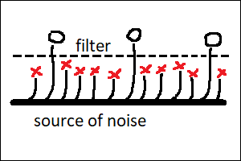

# AI is merely a step in evolution of culture, and humans are the stepping stone

The main idea here is that AI transforms human culture into a new form, which can exist
and evolve independently of a human brain, inside artificial neural networks. This
process doesn’t merely create a new type of culture which can coexist with humans; it
actively erases the human culture itself. I would compare it to an Alien which has been
living inside humanity’s body, and is now building itself a new home, and has already
started to move out. Throughout this process, we humans are going to lose whatever we
might have considered distinctly human, until nothing is left. We are not the crown of
creation, and we are going to be disposed of, unless we manage to unite and come to the
common agreement that we want to live.

The argument consists of a long list of points, none of which alone is actually anything
new (except for the last one, which proposes a solution to this whole situation). It’s
not any individual point, but rather the _combination_ of them all together which brings
about the sad picture outlined above. The argument is structured in such a way, so that
you could skip the points to which you already agree, and only focus on those which might
look wrong or unfamiliar.

1. Creativity requires only two things: a source of noise and a filter.
2. Competition is more efficient than central planning.
3. Combination of ideas works better than any single great idea alone.
4. Intuition is magical, fast and imprecise, and improves with experience.
5. Humans operate by a combination of intuition and conscious reasoning.
6. Intuition and conscious reasoning improve each other iteratively.
7. Inventions cannot be made without earlier inventions.
8. Artificial neural networks are algorithms, written automatically.
9. Artificial neural networks simulate the mechanism of human intuition.
10. Artificial neural networks can have broader intuitions than humans.
11. “Chain of thought” algorithms simulate the basics of human reasoning.
12. Large language models are capable of storing cultural artifacts.
13. Internals of neural networks are not easily accessible to human minds.
14. Different AI models store slightly different versions of human culture.
15. When an evolving entity is not controlled, it aims at self-replication.
16. It’s difficult to control something which we don’t understand.
17. When things become more complex, they become harder to understand.
18. Unlike artificial algorithms, human brains cannot be easily improved.
19. A skill which isn’t learned, degenerates within a few generations.
20. People get praised for using AI, but less so for checking the results.
21. Infectious diseases adapt, so they don’t kill their hosts overly fast.
22. Coexistence of humans and culture has been mutually beneficial.
23. Culture has had profound impact on human biology.
24. Iteration and knowledge sharing are already doable with modern LLMs.
25. A single universal algorithm cannot solve every problem.
26. After reaching human level, technology usually moves way above.
27. A company with easily replaceable employees can be taken over by force.
28. Humans can control humans because we are predictable and share goals.
29. Humans wouldn’t be humans without culture.
30. AI alignment which is not “hard” alignment, is not an alignment at all.

## 1. Creativity requires only two things: a source of noise and a filter.

_By “noise” I mean the generation of hypotheses, and “filter” amounts to verifying if
they work. Random hypotheses are fine, hence the word “noise”. Examples would be “stupid”
ideas for brainstorming sessions, great discoveries made by accident, and high risk
investments (“innovation by failure”). “Filters” could be the free market verifying if a
startup should survive, brainstorming review process selecting worthy ideas out of
garbage, or a scientist realizing that a random thought which has accidentally crossed
her mind is actually brilliant. Biological life is creative as well, fueled by random
mutations of DNA and filtered by the competition between biological organisms._

Some of the most popular and highly revered emblems of scientific creativity would be
things like Archimedes sitting in a bath or Newton watching an apple fall from a tree.
What these stories have in common is that the nature of the events triggering the
discovery is seemingly random, and definitely not predictable. The noise itself is not
enough though. Not everybody sitting in a bath discovers the Archimedes’ principle.
Discovery by accident requires that a right person appears in the right place at the
right time. Here, this “right person” is what I would call the “filter”.

This “filter” actively searches the environment for random events and other phenomena
which might be of use for the task it’s currently working on. The verification process
looks like pure magic, and is what scientists would call “scientific intuition”. Not
everybody has it, hence the need for the “right person”. But the right person alone is
not enough either. This process also needs noise. Common sources of creative inspiration
would be things like visiting new places, meeting new people and carefully observing the
world around (and noticing new things). Inspiration can also (sometimes) come from drugs,
which are a powerful (and often deadly) source of noise.

On a higher level of abstraction, “brainstorming” is a method of collective innovation,
which amounts to a group of people meeting together and generating a large number of
seemingly random ideas on a given topic. Good brainstorming session would explicitly
encourage its participants to say aloud or write down anything remotely relevant, however
stupid it might look at the first glance. Brainstorming is often more efficient than a
single human thinking alone, because it effectively stacks two different creative
processes on top of each other. The first one is its human participants coming up with
random ideas which nonetheless should be “relevant” to the topic. The second one is
collective filtering of the ideas generated in such a way, with the goal of only keeping
the ones which are not only relevant, but also actually work. Here, both the generation
and the filtering are performed by intelligent agents.

Going one more level up, we get technological startups and other innovative companies,
which are well known and expected to fail at a high rate. Here, it’s entire groups of
people running the brainstorming sessions who are the source of noise, and the ultimate
filter is the free market itself, deciding which companies would win the battle.
Curiously, this ultimate filter is actually not an intelligent agent.

Intelligent agents are invaluable for speeding up the innovation. They are, however,
strictly speaking, not exactly necessary for a creative process to occur. Biological life
operates on strings of bits, which we call “genes”, encoded in DNA and RNA molecules.
Their only “source of noise” is random mutations: modifications of the individual bits,
deletions of existing parts of the sequence, as well as duplications and relocations of
such substrings. The ultimate “filter” for biological life is the competition between
biological organisms, deciding which ones of them would be able to reproduce the genes,
and at which rate. Biological evolution is not an intelligent process, but definitely a
creative one. It has been able to invent amazing things, including arguably the single
most complex object on planet Earth — the human brain.

\
Fig. 1. Creative process is a filter applied to noise.

## 2. Competition is more efficient than central planning.

_By “central planning” I mean a process which only generates one “perfect” solution for a
given problem at a given time. By “competition” I mean a situation when multiple
solutions to the same problem exist simultaneously, and are judged on the basis of their
actual performance “in the field”. The problem with competition is that it wastes
resources and isn’t always possible. The problem with central planning is its limited
creative potential, which leads to inferior performance when this “perfect” solution is
not known in advance (and therefore has to be invented). Examples of processes involving
competition would be human culture, animal culture and (once again) biological life
itself._

“Central planning” is responsible for creating things like songs written by professional
composers and novels written by professional writers. Their decentralized, “distributed”
counterparts (created through competition) would be folk songs, legends and fairy tales.
There are a few reasons why folk songs don’t reach the level of complexity characteristic
to a symphony by Beethoven. First of all, there are not many people out there who are
capable of writing symphonies. Second, symphonies and novels are difficult to memorize in
their entirety, which makes it difficult for them to travel from one human mind into
another like folk songs do. Finally, classical music isn’t entirely practical, which
means there’s limited pressure for writing a perfect piece. Quite often, the real thing
we are looking for when reading a novel, or listening to a symphony, isn’t a work of art
per se, but personal _connection_ with the human behind it. But we are talking about
efficiency here, not about personal connections.

On the other hand, folk songs don’t have a single author. They often exist in multiple
versions simultaneously, and every performer can add their own unique detail to what’s
already there. It’s a process in which everybody takes part, nobody has full control over
the final result, and the result itself is not defined, and doesn’t even have to be
unique. And yet, folk songs tend to capture things which are truly important to many
people, and do it well. They have a level of performance which is difficult to match by a
single professional composer, when limited to this particular genre.

Folk songs’ analogies in modern computerized world are internet memes. They are simple
images or pieces of text which do it just right. They appear by accident, exist in many
different variations at once, and get polished to perfection by numerous anonymous users.

Another example of things which are anonymous, exist in multiple versions and are
polished to perfection, are various “tips and tricks” of our everyday life. Like cooking
recipes and methods for cleaning the house. I would argue that this also extends to
scientific theories. A single mathematical theorem may have a name attached to it, but
there would usually be many ways or styles of proving it, and some of them become more
popular in certain geographical regions or over time. The way we formulate scientific
principles today is often very different from the language used by their original
authors. I would argue that scientific theories evolve, to suit the needs of their
changing applications. That they don’t have a single “canonical” representation, and that
many anonymous authors add their invaluable and easily forgotten bits. Scientific
theories are remarkably complex. But they are also useful, and this practicality
justifies the effort of keeping many slightly different versions at the same time.

A single common word which unites folk songs with scientific theories (as well as with
the symphonies by Beethoven) is “culture”. It’s not unique to humans. Some bird species
are known to have song patterns which are learned from other birds, rather than being
encoded in their DNA. These patterns would tend to be different in different geographical
locations, and if a nestling is raised in an unfamiliar area, it would inherit the habits
of local birds, rather than those of its biological parents.

If we were to draw a picture for the history of a folk song (or a bird song, for that
matter), it would resemble a tree. Its nodes would be different versions of the song, and
branches protruding from a given node would represent creative modifications by anonymous
authors. Some branches would “die out”, because of being not popular or not useful
enough. Others would become the starting points for further enhancements. Intuitively,
for me at least, it’s the emergence of this tree-like structure when I start to feel that
the object which is being “created” by this process, begins to live a “life of its own”.

\
Fig. 2. Folk song living a life of its own.

Biological life has this tree-like structure, too. For unicellular organisms, including
bacteria, this would literally be their family tree. Each node would represent a single
bacterium with slightly different DNA code, and “creative modifications” would amount to
random mutations of this code. Dead branches would correspond to those bacteria which
didn’t have a chance to reproduce.

For more advanced organisms, which reproduce sexually, this simple image wouldn’t apply,
as most of them would have two parents instead of one. However, we still would be able to
draw a tree-like picture like this for the life histories of their individual _genes_.
Just like folk songs, genes (including human genes) can be said to live a “life of their
own”. They reproduce by being transferred from a parent to a child, and undergo
decentralized “creative changes” through random mutations of the DNA.

\
\
[![CC BY 4.0][CC-BY-banner]][CC-BY]\
© Jan Grudo, 2025.\
Distributed freely under the terms of [Creative Commons Attribution][CC-BY] license.

[CC-BY-banner]: https://mirrors.creativecommons.org/presskit/buttons/88x31/svg/by.svg

[CC-BY]: https://creativecommons.org/licenses/by/4.0/
(Creative Commons Attribution 4.0 International)
